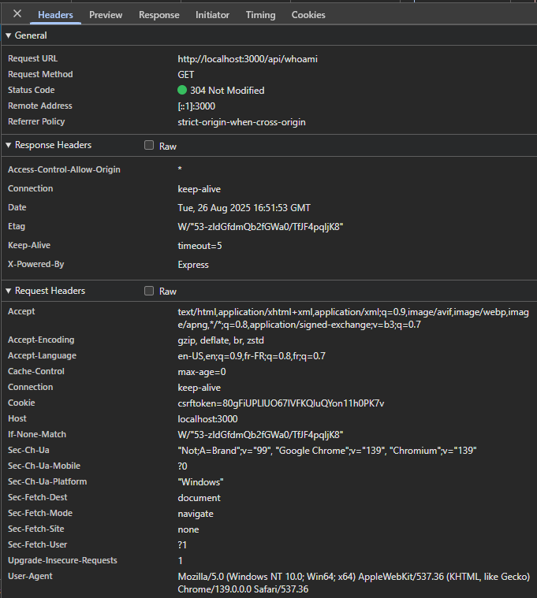

# Request Header Parser Microservice

Goal: build something similar to the official example [here](https://request-header-parser-microservice.freecodecamp.rocks/).

What I focused on:
- Really understanding the `req` object in Express (docs [here](https://expressjs.com/en/api.html#req)).
- Using `req.get(name)` (alias `req.header(name)`) to read a single header.
- Using `req.headers` to inspect all incoming headers.

Example of the headers object (sanitized sample):
```js
{
  host: 'localhost:3000',
  connection: 'keep-alive',
  'sec-ch-ua-platform': '"Windows"',
  'user-agent': 'Mozilla/5.0 (Windows NT 10.0; Win64; x64) AppleWebKit/537.36 (KHTML, like Gecko) Chrome/139.0.0.0 Safari/537.36',
  accept: '*/*',
  'sec-ch-ua': '"Not;A=Brand";v="99", "Google Chrome";v="139", "Chromium";v="139"',
  'sec-ch-ua-mobile': '?0',
  origin: 'null',
  'sec-fetch-site': 'cross-site',
  'sec-fetch-mode': 'cors',
  'sec-fetch-dest': 'empty',
  'accept-encoding': 'gzip, deflate, br, zstd',
  'accept-language': 'en-US,en;q=0.9,fr-FR;q=0.8,fr;q=0.7'
}
```

Browser view (screenshot):


Core output of the microservice (as required by the project) is usually:
```json
{
  "ipaddress": "...",
  "language": "...",
  "software": "..."
}
```

Notes:
- `ipaddress`: from `req.ip` (may need trust proxy if deployed).
- `language`: from `req.get('Accept-Language')`.
- `software`: parsed from `req.get('User-Agent')`.